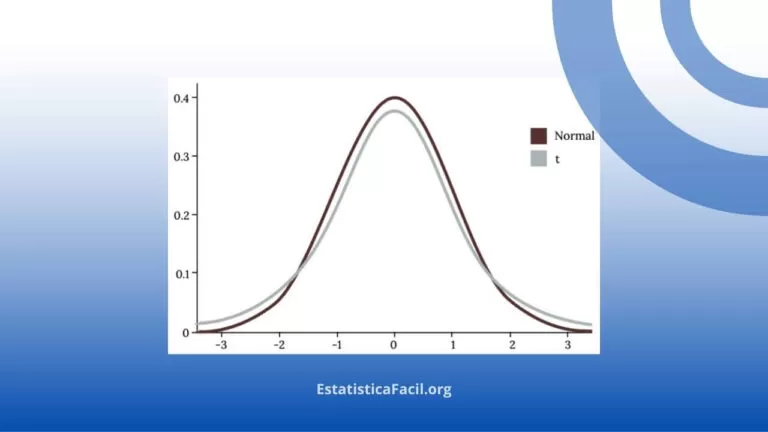

- [P Valor](#p-valor)
  - [O que é P VALOR?](#o-que-é-p-valor)
  - [Hipóteses Estatísticas](#hipóteses-estatísticas)
  - [Nível de Significância e Valor de P](#nível-de-significância-e-valor-de-p)
  - [Estatisticamente Significativo?](#estatisticamente-significativo)
  - [O que Significa o Valor de P?](#o-que-significa-o-valor-de-p)
- [O que é Estatística t, Teste t e Distribuição t?](#o-que-é-estatística-t-teste-t-e-distribuição-t)
  - [Pontos-chave](#pontos-chave)
  - [Estatística t](#estatística-t)
  - [Distribuição t](#distribuição-t)
  - [Teste t](#teste-t)
    - [Há três tipos de teste t:](#há-três-tipos-de-teste-t)
  - [Premissas do Teste t](#premissas-do-teste-t)
  - [Graus de Liberdade](#graus-de-liberdade)
  - [Estatística t, Valor de p e Intervalos de Confiança](#estatística-t-valor-de-p-e-intervalos-de-confiança)
    - [1. **Estatística t:**](#1-estatística-t)
    - [2. **Valor de p:**](#2-valor-de-p)
    - [3. **Intervalos de Confiança:**](#3-intervalos-de-confiança)
    - [Relação Integrada:](#relação-integrada)
  - [Page de Referências:](#page-de-referências)

# P Valor

## O que é P VALOR?

O valor de p representa a probabilidade de a diferença detectada entre os grupos analisados ter ocorrido ao acaso. 

Então,

– Um **pequeno valor de p** (p ≤ 0,05, ou seja, probabilidade menor ou igual a 5%): 
indica que há uma pequena probabilidade de que a diferença observada entre os grupos seja ao acaso, então, você considera que **`há diferença significativa`** entre os grupos.

– Um **grande valor de p** (p > 0,05, ou seja, probabilidade maior que 5%): 
indica que há uma grande probabilidade de que a diferença observada entre os grupos seja ao acaso, então, você considera que **`não há diferença significativa`** entre os grupos.

Na explicação acima, usamos **“diferença entre os grupos”** como exemplo, que se aplica a análises como **teste t** e **Anova**.

Para testes como correlação de Pearson e regressão linear, passaríamos a dizer **“relação entre as variáveis”**.

**Referência:** https://estatisticafacil.org/2020/10/06/valor_de_p/

## Hipóteses Estatísticas

Quando fazemos um **teste inferencial** de hipóteses — como qui-quadrado, teste t, anova, correlação, regressão, etc — temos basicamente duas hipóteses:

 - **HIPÓTESE nula (H0):** A padrão, mais simples, de que não há ‘diferença entre os grupos’ ou não há ‘relação entre as variáveis’.

- **HIPÓTESE alternativa (H1):** Estado alternativo, complementar a H0, de que há ‘diferenças entre grupos’ ou há ‘relação entre as variáveis’.

## Nível de Significância e Valor de P

O **objetivo** básico de todo e qualquer teste de hipóteses é definir se rejeitaremos ou não a hipótese nula (H0) — e essa definição dependerá de dois fatores fundamentais:

1. NÍVEL DE SIGNIFICÂNCIA (**α**)

Representa um valor de corte, um critério que definimos para rejeitar H0 ou não. A definição de seu valor — normalmente 1% ou 5% — deve ser feita anteriormente ao teste.

2. VALOR DE P (p)

O valor de p representa uma probabilidade, e esse valor será obtido sempre que executarmos um teste inferencial de hipóteses.


## Estatisticamente Significativo?

Ao executar nossa análise e obtermos o valor de p, o próximo passo será compará-lo com o nível de significância (**α**) que definimos anteriormente.

Como exemplo, considere que definimos um nível de significância **(α) de 0,05 (ou 5%)**, teríamos então duas possibilidades ao compararmos esse α com nosso valor de p obtido no teste:

1. Quando o valor de p é menor ou igual ao nível de significância α **`(p ≤ 0,05)`**, devemos então **`rejeitar`** a **`hipótese nula (H0)`**. Aqui dizemos que nosso teste foi **`estatisticamente significativo`**.

2. Quando o valor de p é maior que o nível de significância α **`(p > 0,05)`**, devemos então **`não rejeitar`** a **`hipótese nula (H0)`**. Aqui dizemos que nosso teste **`não foi estatisticamente significativo`**.

## O que Significa o Valor de P?

Em termos técnicos o valor de p pode ser definido como:

> A probabilidade de obtermos um resultado igual (ou mais  extremo)
> ao obtido a partir dos nossos dados, assumindo que a hipótese nula é verdadeira.

Se meu teste retornou, por exemplo, p = 2%, o que isso significa?

Se considerarmos H0 verdadeira, a probabilidade de obtermos resultados iguais (ou mais extremos) que o nosso, será de apenas 2%. Como foi menor que o α = 5%, rejeitamos H0. Veja a seguir.

**Referência:** https://estatisticafacil.org/2022/02/18/valor_de_p_retorno/


# O que é Estatística t, Teste t e Distribuição t?

A estatística é a espinha dorsal da análise de dados, e a estatística t, oriunda da distribuição t, é um dos seus pilares fundamentais.

Essa ferramenta não apenas desempenha um papel vital em testes de hipóteses, particularmente nos testes t, mas também é a chave para entender como e por que certas conclusões são retiradas de conjuntos de dados.

Dominar a estatística t é mais do que uma mera habilidade acadêmica; é uma necessidade para qualquer um que queira analisar dados com precisão e confiança.

## Pontos-chave

* Testes t avaliam diferenças entre médias amostrais.
* A estatística t considera desvio padrão e tamanho da amostra.
* Testes t requerem a verificação de premissas como normalidade.
* **`P-valores baixos sugerem diferenças estatisticamente significativas`**.
* Erros comuns incluem assumir normalidade e ignorar premissas.

## Estatística t

A **estatística t**, também conhecida como **valor t** ou **t de Student**, é uma **medida** que nos ajuda a determinar quão grande é a diferença entre as médias de duas amostras, considerando a variabilidade nos dados.

Em outras palavras, **ela compara a diferença** observada entre as médias das amostras com o que poderíamos esperar por acaso. Se essa diferença for significativamente grande, concluímos que as médias das populações das quais as amostras foram retiradas provavelmente são diferentes.

## Distribuição t

A distribuição t, também conhecida como distribuição de Student, é uma das distribuições de probabilidade mais importantes no campo da estatística, especialmente quando se trata de inferir sobre uma população a partir de uma amostra pequena.

**`Origem:`** A distribuição t foi introduzida por William Sealy Gosset sob o pseudônimo “Student” em 1908. Ele estava trabalhando na empresa de cervejaria Guinness e desenvolveu esta distribuição para lidar com problemas estatísticos envolvendo pequenas amostras.




**Referência:** https://estatisticafacil.org/estatistica-t/

## Teste t

O **teste t é um instrumento refinado** de análise que se vale da estatística t para confrontar as médias de dois conjuntos de dados. O que ele busca discernir é a natureza da variação entre esses conjuntos: é uma diferença genuinamente significativa? Ou poderia essa variação ser atribuída simplesmente ao capricho do acaso?

### Há três tipos de teste t:

> **`Teste t de Uma Amostra:`** O teste t de uma amostra confronta a média de uma única amostra com uma média populacional já conhecida. Este tipo de teste é frequentemente adotado quando os pesquisadores desejam verificar se a média da amostra diverge de maneira significativa de um valor hipotetizado. Aqui, a estatística t é determinada comparando-se a média da amostra com a média da população, levando em consideração o tamanho da amostra e seu desvio padrão.

>**`Teste t para Amostras Independentes:`** Este teste, também conhecido como teste t de duas amostras, é aplicado ao se comparar as médias de duas amostras independentes. O principal objetivo é averiguar se existe uma diferença significativa entre as médias das populações das quais as amostras foram extraídas. Para este teste, a estatística t é calculada considerando-se a discrepância entre as médias das amostras, suas variâncias e os respectivos tamanhos das amostras.

>**`Teste t para Amostras Emparelhadas:`** O teste t para amostras emparelhadas, ou teste t para amostras dependentes, é indicado para comparação das médias de duas amostras relacionadas. Este teste é utilizado quando as observações são feitas em pares, como medições antes e depois de um tratamento, ou sujeitos pareados em designs experimentais. Para este teste, a estatística t é derivada considerando-se as diferenças entre as observações emparelhadas e suas médias, bem como o desvio padrão.

## Premissas do Teste t

Garantir que as premissas abaixo sejam atendidas permite aplicar os testes t e a estatística t em suas pesquisas e análises de dados, conduzindo a conclusões válidas e confiáveis.

>**`Dados em Escala de Intervalo ou Razão:`** Os testes t são projetados para dados contínuos que podem ser medidos em uma escala de razão ou intervalo. Estes tipos de dados possuem intervalos iguais entre os valores e um ponto zero significativo.

>**`Independência das Observações:`** As observações nas amostras devem ser independentes entre si. Isso implica que a ocorrência de uma observação não deve influenciar a probabilidade de outra observação acontecer. No teste t para amostras independentes, as amostras devem ser selecionadas de forma aleatória e não relacionadas entre si. Para o teste t de amostras emparelhadas, cada par de observações deve ser independente dos outros pares. 

>**`Normalidade:`** Os dados devem ter uma distribuição aproximadamente normal, especialmente para tamanhos de amostras pequenos. Este pressuposto sugere que a distribuição de amostragem das médias segue uma distribuição normal ou quase normal. Embora os testes t sejam considerados robustos a desvios moderados da normalidade, violações graves podem afetar a precisão dos resultados do teste.

>**`Homogeneidade das Variâncias:`** No teste t para amostras independentes, as variâncias das duas populações comparadas devem ser iguais ou, pelo menos, aproximadamente iguais. Esse pressuposto é conhecido como homogeneidade das variâncias. Se esse pressuposto for violado, testes alternativos, como o **teste t de Welch**, podem ser empregados, pois este último não exige variâncias iguais.

## Graus de Liberdade

Os graus de liberdade representam um conceito fundamental na estatística e têm implicações profundas no cálculo da estatística t e na determinação dos valores críticos em testes t.

**Mas, o que são exatamente os graus de liberdade?** São o número de valores numa análise que têm a liberdade de variar sem infringir qualquer regra estabelecida — em outras palavras, são as observações independentes que podem ser usadas para estimar um parâmetro.

```
Exemplo:

Imagine que você tem cinco amigos e está tentando calcular a média das idades deles. Você sabe que a média de suas idades é 25 anos. Se você souber a idade de quatro desses amigos, você poderá facilmente calcular a idade do quinto amigo, mesmo sem ninguém te dizer qual é.

Por exemplo: Amigo 1: 24 anos; Amigo 2: 25 anos; Amigo 3: 26 anos; e Amigo 4: 23 anos.

Usando a informação de que a média é 25 anos, podemos calcular a idade do Amigo 5. Se somarmos as idades dos quatro primeiros amigos, obtemos um total de 98 anos. Para que a média das cinco idades seja 25 anos, o total combinado deve ser 125 anos (25 anos x 5 amigos). Isso significa que o Amigo 5 tem 27 anos (125 – 98 = 27).

Neste exemplo, os graus de liberdade são 4. Isso porque podemos escolher qualquer idade para os primeiros quatro amigos, mas depois que essas idades forem determinadas, a idade do quinto amigo é fixada pela média que conhecemos. Portanto, só temos “liberdade” para variar as idades de 4 dos 5 amigos.
```

No universo dos testes t, os graus de liberdade determinam a forma específica da distribuição t, essencial para calcular os valores p e tomar decisões estatísticas sobre as diferenças entre grupos.

**Como calculamos os graus de liberdade para diferentes testes t:**

>**`Teste t de Uma Amostra:`** Simplesmente subtrai-se um do tamanho total da amostra. Matematicamente falando: gl = n – 1.

>**`Teste t para Amostras Independentes:`** Neste cenário, temos duas amostras diferentes. A fórmula considera o tamanho de ambas as amostras: gl = n1 + n2 – 2.

>**`Teste t para Amostras Emparelhadas:`** Aqui, comparamos dois conjuntos de observações do mesmo grupo, como um “antes e depois”. Os graus de liberdade são calculados subtraindo um do número total de pares: gl = n – 1.

A correta **compreensão** e **aplicação** dos graus de liberdade não apenas asseguram a precisão da sua análise, mas também a confiabilidade das conclusões extraídas dela.

## Estatística t, Valor de p e Intervalos de Confiança

Estes três componentes formam a espinha dorsal da inferência estatística, permitindo aos pesquisadores e analistas de dados não apenas identificar diferenças significativas em seus conjuntos de dados, mas também entender o contexto e a relevância dessas diferenças.

### 1. **Estatística t:**

**Definição:** Originada da distribuição t, a estatística-t quantifica a diferença entre médias amostrais, levando em consideração o desvio padrão e o tamanho da amostra.

**Aplicação:** Usada principalmente em testes t para contrastar médias amostrais, ela serve como um índice para avaliar o quão longe a nossa amostra está da população sob a hipótese nula.

### 2. **Valor de p:**

**Definição:** Uma métrica que indica a probabilidade de observar um resultado, como o obtido (ou mais extremo), assumindo que a hipótese nula (H0) é verdadeira.

**Interpretação:** Um `p-valor pequeno` — frequentemente, menor que 0.05 — sugere que os dados observados são `inconsistentes com a hipótese nula (H0)`, permitindo-nos `rejeitá-la` em favor da hipótese alternativa (H1). Portanto, `um p-valor baixo sinaliza uma diferença estatisticamente significativa.`

### 3. **Intervalos de Confiança:**

**Definição:** Uma estimativa de intervalo que indica a faixa dentro da qual esperamos que o verdadeiro valor da população esteja, com uma certa confiança (como 95%).

**Interpretação:** Em testes t, esses intervalos nos oferecem uma faixa de valores prováveis para as diferenças entre as médias populacionais ou a média da população em si. A **amplitude desse intervalo é influenciada por fatores como a estatística-t**, o tamanho da amostra e a variabilidade dos dados.

### Relação Integrada:

>A estatística-t nos fornece uma métrica de diferença que é, então, avaliada em termos de sua probabilidade sob a hipótese nula — daí surge o p-valor.

>Ao mesmo tempo, a estatística-t alimenta a construção dos intervalos de confiança, proporcionando uma visão mais ampla da diferença, não apenas em termos de significância, mas também de magnitude e relevância prática.

Em suma, ao **combinar** a estatística-t, o p-valor e os intervalos de confiança, obtemos uma imagem completa e multidimensional da diferença observada, auxiliando na tomada de decisões informadas e na interpretação precisa dos resultados.

**Referência:** https://estatisticafacil.org/estatistica-t/

## Page de Referências:
[Conceitos Estatísticos Exemplos](Conceitos%20Estatisticos%20Exemplos.MD)


