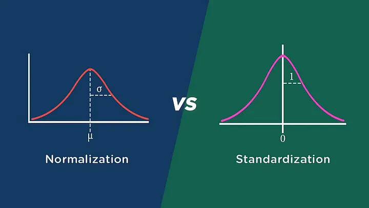

- [1. Compreensão do Negócio (Business Understanding)](#1-compreensão-do-negócio-business-understanding)
- [2. Compreensão dos Dados (Data Understanding)](#2-compreensão-dos-dados-data-understanding)
  - [2.1 Análise Exploratória de Dados (EDA)](#21-análise-exploratória-de-dados-eda)
- [3. Preparação dos Dados (Data Preparation)](#3-preparação-dos-dados-data-preparation)
  - [3.1 - Normalização, Padronização e Transformações](#31---normalização-padronização-e-transformações)
    - [3.1.1 Normalização (Normalization or Scaling)](#311-normalização-normalization-or-scaling)
    - [3.1.2 Padronização (Standardization)](#312-padronização-standardization)
    - [3.1.2 Transformações (Transformations)](#312-transformações-transformations)
- [Referências](#referências)

# 1. Compreensão do Negócio (Business Understanding)

---

# 2. Compreensão dos Dados (Data Understanding)

---

## 2.1 Análise Exploratória de Dados (EDA)

Explorar os dados para entender suas características, distribuições e relações.

---

# 3. Preparação dos Dados (Data Preparation)

Os dados brutos raramente estão prontos para a análise. Nesta fase, realizamos a limpeza dos dados, tratamos valores ausentes ou inconsistentes e integramos diferentes fontes de dados. O objetivo é criar um conjunto de dados preparado para as etapas subsequentes.

## 3.1 - Normalização, Padronização e Transformações

Uma atividade muito rotineira de um cientista de dados dentro do pré-processamento, é a transformação de seus dados numéricos com o objetivo de que todos eles fiquem com a mesma ordem de grandeza. Isso evita que o modelo fique enviesado, dando maior peso para as variáveis de maior grandeza.

### 3.1.1 Normalização (Normalization or Scaling)

A normalização coloca os dados dentro do intervalo de 0 a 1 (ou -1 a 1 se houver valores negativos) sem distorcer as diferenças nos intervalos de valores. Ele não remove outliers (valores extremos), mas garante que todos os pontos de dados estejam em uma escala comum.

Normalizar os dados usando Min-Max:

$$
x' = \frac{x - \min(x)}{\max(x) - \min(x)}
$$

Se a distribuição não é Gaussiana ou o desvio padrão é muito pequeno, normalizar os dados é uma escolha a ser tomada.

### 3.1.2 Padronização (Standardization)

Já a padronização irá transformar as variáveis fazendo com que elas resultem em uma média igual a 0 e desvio padrão igual a 1.
Padronizar os dados normalmente é feita usando a fórmula z-score:
$$
z = \frac{x - \mu}{\sigma}
$$

### 3.1.2 Transformações (Transformations)

Estes envolvem a aplicação de funções logarítmicas (como o logaritmo natural) aos dados. Eles são úteis para lidar com distribuições assimétricas e comprimir grandes faixas de valores.
[Leia mais: Transformacoes](page/Transformacoes.md)
[Veja alguns exemplos: Notebooks](page/Transformationacoes.md)

# Referências

- [Normalizar ou Padronizar as Variáveis?](https://medium.com/data-hackers/normalizar-ou-padronizar-as-vari%C3%A1veis-3b619876ccc9)
- [Normalização x Padronização: Qual a Diferença?](https://medium.com/@ingoreichertjr/normaliza%C3%A7%C3%A3o-x-padroniza%C3%A7%C3%A3o-qual-a-diferen%C3%A7a-fa14352df501)
- [O escalonamento dos dados: Normalização ou Padronização?](https://www.linkedin.com/pulse/o-escalonamento-dos-dados-normaliza%C3%A7%C3%A3o-ou-gabriel-b-marques/)