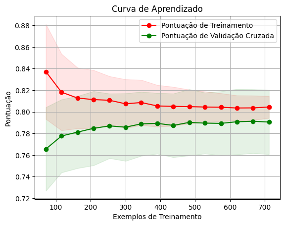
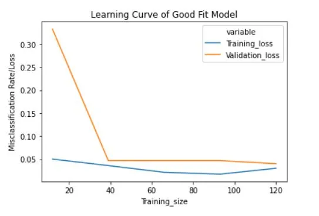
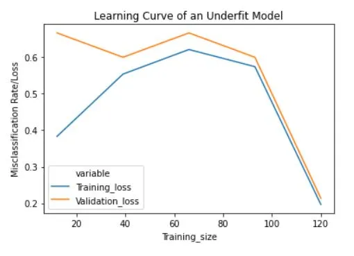
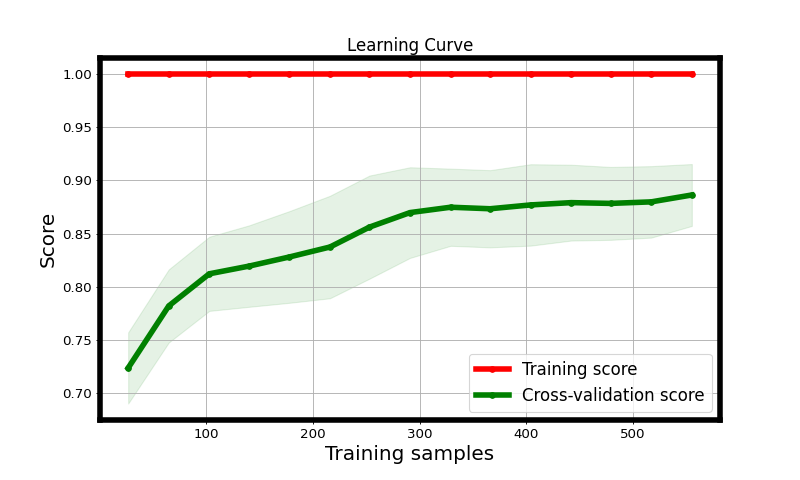
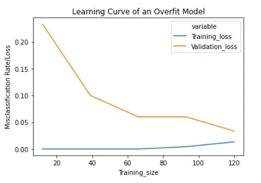

- [5 - Avaliação (Evaluation)](#5---avaliação-evaluation)
  - [Avaliação de Métricas e Interpretação do Modelo](#avaliação-de-métricas-e-interpretação-do-modelo)
  - [Função `learning_curve`](#função-learning_curve)
    - [Parâmetros Principais:](#parâmetros-principais)
    - [Saída:](#saída)
    - [Utilidade:](#utilidade)
  - [Interpretação da Curva de Aprendizado](#interpretação-da-curva-de-aprendizado)
    - [Curva de Treinamento (Vermelha):](#curva-de-treinamento-vermelha)
    - [Curva de Validação (Verde):](#curva-de-validação-verde)
    - [Subajustamento (Underfitting):](#subajustamento-underfitting)
    - [Superajustamento (Overfitting):](#superajustamento-overfitting)
    - [Conclusão](#conclusão)
      - [**`Exemplificação de Plateau`**](#exemplificação-de-plateau)
  - [Leia mais](#leia-mais)
- [6.0 Implantação (Deployment)](#60-implantação-deployment)

# 5 - Avaliação (Evaluation)

A avaliação dos modelos desenvolvidos é crucial para medir sua qualidade e desempenho. Nesta fase, utilizamos métodos como validação cruzada e métricas de desempenho para avaliar o quão bem os modelos se saem em dados não vistos. Com base nessa avaliação, podemos ajustar e aprimorar os modelos, se necessário.

## Avaliação de Métricas e Interpretação do Modelo

1. **Calcular métricas de desempenho**, como precisão, recall, F1-score, etc., no conjunto de teste para avaliar o desempenho do modelo.

2. **Interpretação do Modelo:** Compreender como o modelo está tomando decisões, quais características são importantes e se está seguindo padrões esperados.

---

## Função `learning_curve`

A função `learning_curve` é uma ferramenta do scikit-learn que permite visualizar como o desempenho de um modelo varia com o tamanho do conjunto de treinamento. Ela é útil para entender como o modelo se comporta à medida que é treinado com mais dados e para identificar problemas de **`underfitting`** ou **`overfitting`**.

### Parâmetros Principais:

- **Estimator**: O estimador ou modelo de machine learning a ser avaliado. Deve ser um objeto que implementa os métodos `fit` e `predict`.

- **X**: O conjunto de características de entrada.

- **y**: O vetor alvo.

- **Train_sizes**: Os tamanhos relativos dos conjuntos de treinamento a serem usados. Pode ser especificado como uma lista de porcentagens ou como uma lista de números inteiros representando tamanhos absolutos.

- **cv**: O esquema de validação cruzada a ser usado. Pode ser um objeto `KFold`, `StratifiedKFold`, ou um inteiro especificando o número de folds.

- **Scoring**: A métrica de avaliação a ser usada. Pode ser uma string representando uma métrica integrada do scikit-learn (como 'accuracy', 'precision', 'recall', etc.) ou uma função de pontuação personalizada.

### Saída:

A função `learning_curve` retorna cinco arrays:

- **Train_sizes_abs**: O número de amostras usadas em cada fold de treinamento.

- **Train_scores**: O desempenho do modelo no conjunto de treinamento para cada tamanho de conjunto de treinamento.

- **Test_scores**: O desempenho do modelo no conjunto de teste (ou validação) para cada tamanho de conjunto de treinamento.

- **fit_times**: O tempo necessário para treinar o modelo para cada tamanho de conjunto de treinamento.

- **score_times**: O tempo necessário para avaliar o modelo para cada tamanho de conjunto de treinamento.

### Utilidade:

A função `learning_curve` é útil para:

- Visualizar como o desempenho do modelo muda com o tamanho do conjunto de treinamento.
- Identificar se o modelo está sofrendo de underfitting (baixo desempenho em conjuntos de treinamento pequenos) ou overfitting (alta variação entre os conjuntos de treinamento e teste).
- Determinar se coletar mais dados de treinamento pode melhorar o desempenho do modelo.

Em resumo, a função `learning_curve` é uma ferramenta valiosa para entender a capacidade de generalização do modelo em relação ao tamanho do conjunto de treinamento e para orientar decisões importantes de modelagem em machine learning.

## Interpretação da Curva de Aprendizado

### Curva de Treinamento (Vermelha):

- **Inicialmente Alta e Estável:** Se a curva de treinamento começa alta e permanece estável, isso indica que o modelo está aprendendo bem com os dados de treinamento.
- **Declínio Inicial:** Pode haver um declínio inicial na acurácia de treinamento à medida que o tamanho do conjunto de treinamento aumenta, o que é normal pois mais dados aumentam a complexidade do problema.

### Curva de Validação (Verde):

- **Inicialmente Baixa e Crescendo:** Se a curva de validação começa baixa e sobe, isso indica que o modelo está melhorando com mais dados de treinamento, o que é um bom sinal.
- [**Plateau:**](#exemplificação-de-plateau) Se a curva de validação atinge um plateau e não melhora com mais dados, isso pode indicar que mais dados não vão melhorar o desempenho e pode ser necessário ajustar os hiperparâmetros do modelo.
  

### Subajustamento (Underfitting):

- **Ambas as Curvas Baixas:** Se tanto a curva de treinamento quanto a curva de validação são baixas e próximas uma da outra, o modelo não está capturando bem os padrões dos dados. Pode ser necessário um modelo mais complexo.

### Superajustamento (Overfitting):

- **Curva de Treinamento Alta e Curva de Validação Baixa:** Se a curva de treinamento é alta e a curva de validação é significativamente mais baixa, o modelo está se ajustando demais aos dados de treinamento e não está generalizando bem. Técnicas como regularização, redução da complexidade do modelo ou aumento do conjunto de dados podem ajudar.

### Conclusão

A análise da curva de aprendizado ajuda a identificar o comportamento do modelo e decidir os próximos passos para melhorar seu desempenho. Dependendo do padrão observado nas curvas de treinamento e validação, você pode ajustar o modelo, coletar mais dados ou alterar a abordagem de pré-processamento e engenharia de características.

#### **`Exemplificação de Plateau`**

Imagine que você está treinando um modelo de regressão logística e está monitorando a acurácia da validação ao longo do tempo ou conforme você aumenta a quantidade de dados de treinamento. Inicialmente, a acurácia da validação melhora à medida que você adiciona mais dados, mas eventualmente, ela começa a se estabilizar e atinge um ponto onde não há mais melhorias significativas, mesmo com a adição de mais dados. Esse ponto de estabilização é chamado de **plateau**.

## Leia mais

[Learning_Curves](_Notebooks_teoria_aplicada\learning_curves.md)
[Notebook: Learning_Curves_2](_Notebooks_teoria_aplicada\Learning_curve_2.ipynb)

---

# 6.0 Implantação (Deployment)

A fase final da metodologia CRISP-DM é a implantação do modelo em um ambiente de produção. Integramos o modelo aos sistemas existentes, monitoramos seu desempenho contínuo e garantimos a adoção pela equipe de negócios.