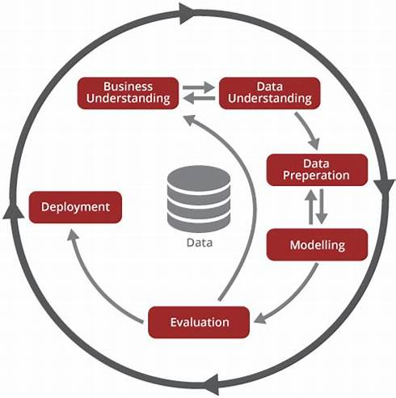

- [Desenvolvimento de Modelo de Machine Learning](#desenvolvimento-de-modelo-de-machine-learning)
  - [**`Pré-Treinamento`**](#pré-treinamento)
  - [**`Treinamento`**](#treinamento)
  - [**`Pós-Treinamento`**](#pós-treinamento)
- [Visão Geral da Metodologia CRISP-DM](#visão-geral-da-metodologia-crisp-dm)
# Desenvolvimento de Modelo de Machine Learning

Este projeto segue uma abordagem estruturada para o desenvolvimento de modelos de Machine Learning, utilizando  a metodologia do CRISP-DM dentro de três grandes grupos:

## **`Pré-Treinamento`**

## **`Treinamento`**

## **`Pós-Treinamento`**

As etapas do processo do **`CRISP-DM`** serão inseridas entre esses grupos.

# Visão Geral da Metodologia CRISP-DM

A metodologia CRISP-DM (Cross-Industry Standard Process for Data Mining) é um estrutura abrangente que tem se destacado na abordagem de projetos de Ciência de Dados, essa metodologia é composta por seis fases interativas que guiam os profissionais de ciência de dados durante todo o processo de descoberta de conhecimento a partir de dados. Vamos explorar cada uma dessas fases em detalhes:

1. **Compreensão do Negócio** *(Business Understanding)* Antes de iniciar um projeto de análise de dados, é essencial compreender o contexto e os objetivos do negócio. Nesta fase, definimos claramente as metas do projeto e as alinhamos aos objetivos estratégicos da organização.

2. **Compreensão dos Dados** *(Data Understanding)* Coletar dados relevantes é fundamental para o sucesso do projeto. Nessa fase, exploramos e nos familiarizamos com os dados disponíveis, identificamos lacunas e problemas potenciais, e avaliamos a qualidade e a adequação dos dados para o projeto.

3. **Preparação dos Dados** *(Data Preparation)* Os dados brutos raramente estão prontos para a análise. Nesta fase, realizamos a limpeza dos dados, tratamos valores ausentes ou inconsistentes e integramos diferentes fontes de dados. O objetivo é criar um conjunto de dados preparado para as etapas subsequentes.

4. **Modelagem** *(Modeling)* A fase de modelagem envolve a aplicação de técnicas e algoritmos de modelagem de dados aos dados preparados. Selecionamos as técnicas mais adequadas, como regressão, classificação ou agrupamento, e ajustamos e avaliamos os modelos para garantir sua precisão e eficácia.

5. **Avaliação** *(Evaluation)* A avaliação dos modelos desenvolvidos é crucial para medir sua qualidade e desempenho. Nesta fase, utilizamos métodos como validação cruzada e métricas de desempenho para avaliar o quão bem os modelos se saem em dados não vistos. Com base nessa avaliação, podemos ajustar e aprimorar os modelos, se necessário.

6. **Implantação** *(Deployment)* A fase final da metodologia CRISP-DM é a implantação do modelo em um ambiente de produção. Integramos o modelo aos sistemas existentes, monitoramos seu desempenho contínuo e garantimos a adoção pela equipe de negócios.

